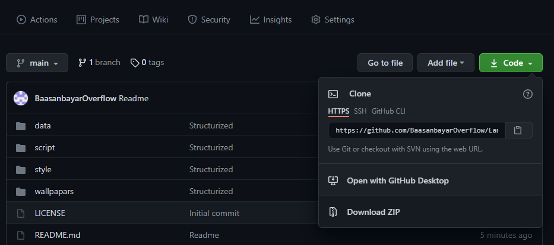
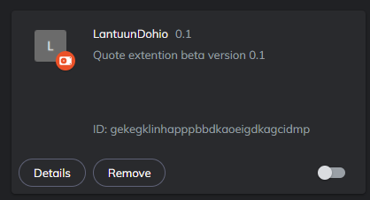

# LantuuExtension :heart::heart::heart:
This web browser extension is dedicated only for Lantuu members

Энэхүү интернет хөтчийн нэмэлт /add-on/ нь Лантуун дохиогийн үндсэн гишүүдэд зориулан бэлтгэж буй том төслийн ердөө нэг өчүүхэн хэсэг бөгөөд туршилтын зорилгоор гишүүдтэйгээ хамтран хөгжүүлье :smile: гэсэн бодлоор нийтэллээ. :wink:
Одоогоор гүйцэтгэдэг функц нь хөтчөөсөө шинэ цонх нээхэд англи хэлээр алдартай хүмүүсийн хэлсэн үгсийг дэлгэцэнд хэвлэнэ (with style :stuck_out_tongue:). Туршилтын шатанд байгаа учраас нэмэх, засах, солих олон зүйлс бий. Тиймээс сэтгэгдлээ битгий харамлаарай (:smiling_imp: give me your precious feedbacks) :blush::kissing_heart::heart_eyes:

#Суулгах заавар :shipit:
- Нэмэлтийг татахдаа цэснээс **Download ZIP** товчийг дарж татна. 

- Татсан **LantuuExtension-main.zip** файлаа 
    1. Local Disk (C:)/Program Files (x86)/BraveSoftware/
    2. Local Disk (C:)/Program Files (x86)/Microsoft/Edge/
    3. Local Disk (C:)/Program Files (x86)/Opera/
    4. Local Disk (C:)/Program Files (x86)/Google Chrome/
    5. Local Disk (C:)/Program Files (x86)/Mozilla firefox/
    дээрхээс өөрийн ашигладаг хөтчийн хавтас дотор шинээр `LantuuExtension` нэртэй хавтас үүсгээд, **LantuuExtension-main.zip** файлаа задлана.
- Интернет хөтөч рүүгээ задалсан кодоо хуулахдаа
    1. Brave    

    Баруун дээд булан дахь үндсэн цэсний хэсгээс `Extensions` дарж, нээгдсэн шинэ цонхны баруун дээр булангийн `developer mode` горимыг идэвхжүүлнэ. Үүний дараагаар шинээр нээгдсэн нэмэлт цэсний `Load unpacked` товчийг дарж, үүсгэсэн `LantuuExtension` folder-оо заана.

